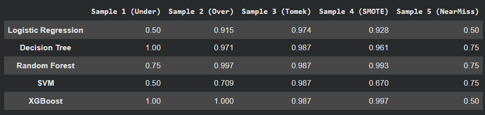

# Imbalanced Data Sampling – Model Comparison

## Problem Statement
The dataset is imbalanced. The objective is to evaluate how different sampling techniques affect classification model performance using accuracy.

## Methodology
1. Applied different sampling techniques to handle class imbalance.
2. Trained multiple classification models on each sampled dataset.
3. Evaluated model performance using accuracy.

## Sampling Techniques
- UnderSampling  
- OverSampling  
- Tomek Links  
- SMOTE  
- NearMiss  

## Models Used
- Logistic Regression  
- Decision Tree  
- Random Forest  
- SVM  
- XGBoost  

## Accuracy Matrix

> *Note: Perfect accuracy may occur due to the effect of sampling techniques on certain models.*

## Result Graph
The accuracy comparison graph represents model performance across different sampling techniques.

## Best Performing Model
**XGBoost with Sample 4 (SMOTE)**
